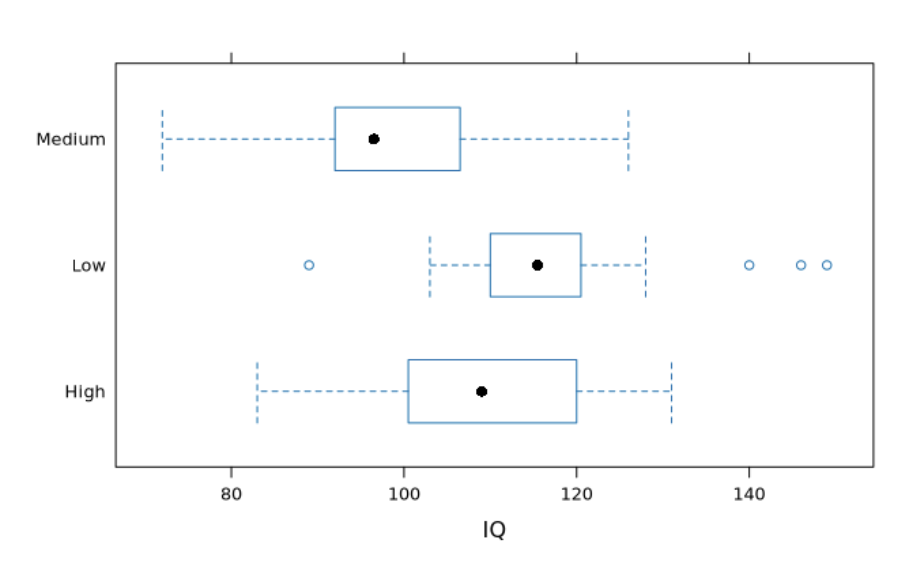
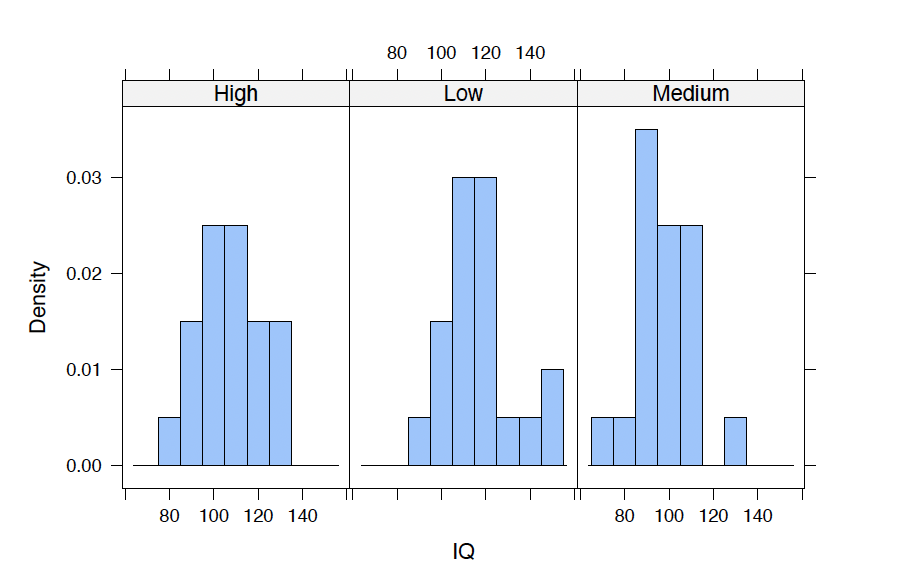
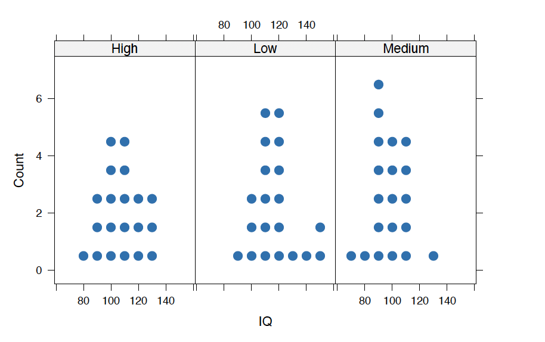

# Education Level and IQ

**Author:**
Ali Efe Isik

**Introduction**

&emsp;&emsp;&emsp;This project investigates the relationship between education level and IQ scores using a stratified sample of 60 individuals from the city of Hofn. The central research questions are:

* Is there a significant difference in average IQ scores among different education levels (high school or less, some college or bachelor's degree, master's degree or PhD)?
* Is there a significant difference between the average IQ scores of those with a high school degree or less and those with at least some college education?

&emsp;&emsp;&emsp;IQ was treated as the quantitative response variable, measured using a standard IQ test. Education level served as the categorical explanatory variable with three groups: Low (high school or less), Medium (some college or bachelor's degree), and High (master's degree or PhD). Data collection used stratified sampling with 20 participants per education group.

**Methods**

&emsp;&emsp;&emsp;Participants were visited twice — once to distribute the survey and IQ test, and once to collect results. The response rate was 90%, though the consent rate was lower at 60%. Some participant dropout required replacements, which may introduce minor sampling bias. Ultimately 60 individuals completed the study, 20 from each education level.

&emsp;&emsp;&emsp;Descriptive statistics were computed for each group before conducting formal hypothesis tests. The five-number summary for IQ scores by group is shown below:

| Group  | Min | Q1     | Median | Q3     | Max | SD    |
|--------|-----|--------|--------|--------|-----|-------|
| High   | 83  | 101.25 | 109    | 119.50 | 131 | 14.28 |
| Medium | 72  | 92.00  | 96     | 106.00 | 126 | 12.97 |
| Low    | 89  | 110.50 | 115.5  | 119.25 | 149 | 14.55 |

**Figure 1 — Side by Side Boxplot**

&emsp;&emsp;&emsp;The boxplot reveals that the Medium education group has noticeably lower IQ scores compared to the Low and High groups, with a tighter distribution. The Low group shows the highest median and several high-end outliers, suggesting greater spread at the upper end.

**Figure 2 — Histogram**

&emsp;&emsp;&emsp;The histograms confirm that the Medium group's distribution is concentrated at lower IQ values, while the Low group's distribution is more spread and shifted rightward. The High group falls in between.

**Figure 3 — Dotplot**

&emsp;&emsp;&emsp;The dotplot provides an individual-level view of each group's scores, reinforcing the patterns observed in the boxplot and histogram.

**Hypothesis Test — ANOVA**

&emsp;&emsp;&emsp;A one-way ANOVA was conducted to test whether the long-run average IQ scores differ across the three education groups.

- **Null hypothesis:** µ_low = µ_med = µ_high
- **Alternative hypothesis:** At least one µ_i is different

&emsp;&emsp;&emsp;ANOVA validity conditions were met: each group had at least 20 observations, distributions within each group were approximately normal, and homogeneity of variance was satisfied.

- **F-statistic: 9.352**
- **p-value: 0.0003**
- **R² = 24.7%**

&emsp;&emsp;&emsp;The probability of observing an F-statistic as large as 9.352 under the null hypothesis is 0.0003, which is well below the 0.05 significance threshold. We reject the null hypothesis and conclude that education level is associated with differences in average IQ scores. 24.7% of the variance in IQ scores is explained by education level.

**Post-hoc Analysis**

&emsp;&emsp;&emsp;Pairwise comparisons were conducted to identify which groups drove the significant ANOVA result:

| Comparison  | p-value | 95% Confidence Interval |
|-------------|---------|--------------------------|
| High – Low  | 0.157   | [-2.37, 18.9]            |
| High – Med  | 0.046   | [-21.4, -0.132]          |
| Low – Med   | 0.0001  | [-19.0, -29.6]           |

&emsp;&emsp;&emsp;The significant differences were between the Medium group and both other groups. The High and Low groups did not differ significantly from each other. Confidence intervals for High–Med and Low–Med do not contain zero, confirming these pairwise differences are statistically meaningful.

**Conclusion**

&emsp;&emsp;&emsp;The analysis provides evidence that education level is associated with IQ score differences, driven primarily by the Medium education group scoring lower than both the Low and High groups. These results should be interpreted cautiously given the low consent rate, potential convenience sampling bias, and participant dropout during data collection. A larger, more randomized sample would be needed to generalize findings beyond this study population.

**Tools Used**

R, RStudio, R Markdown, tidyverse (ggplot2)
